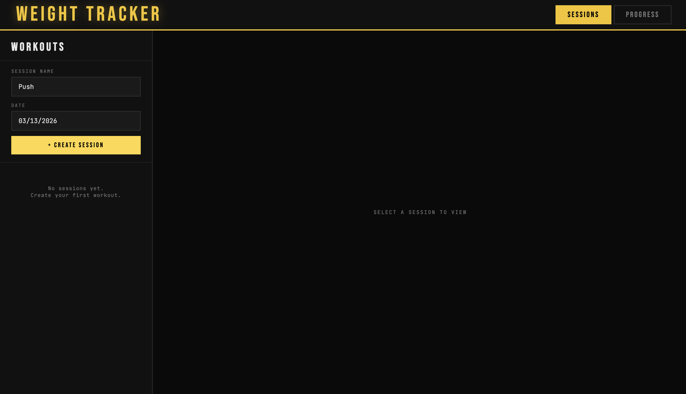
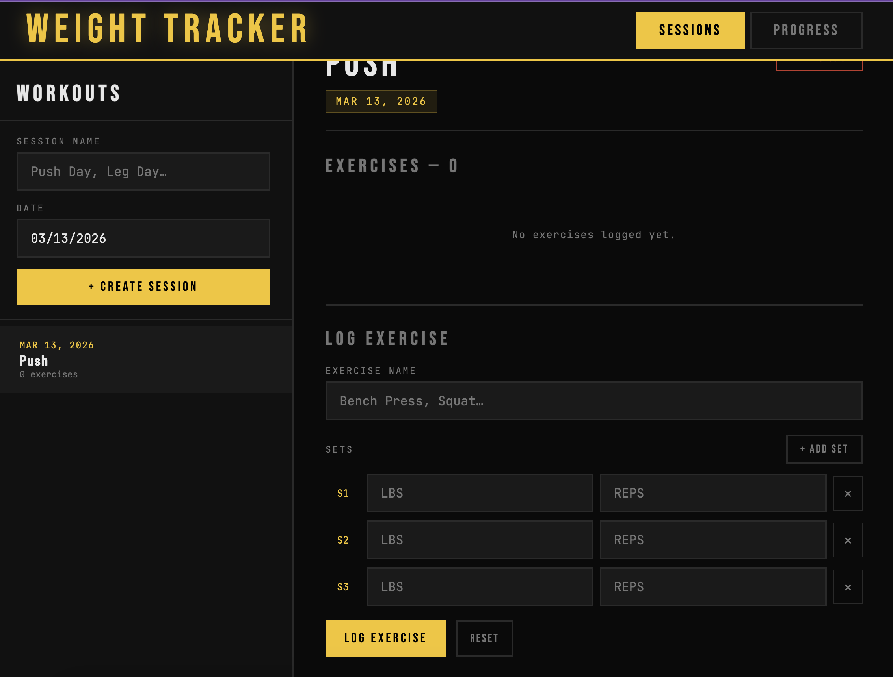
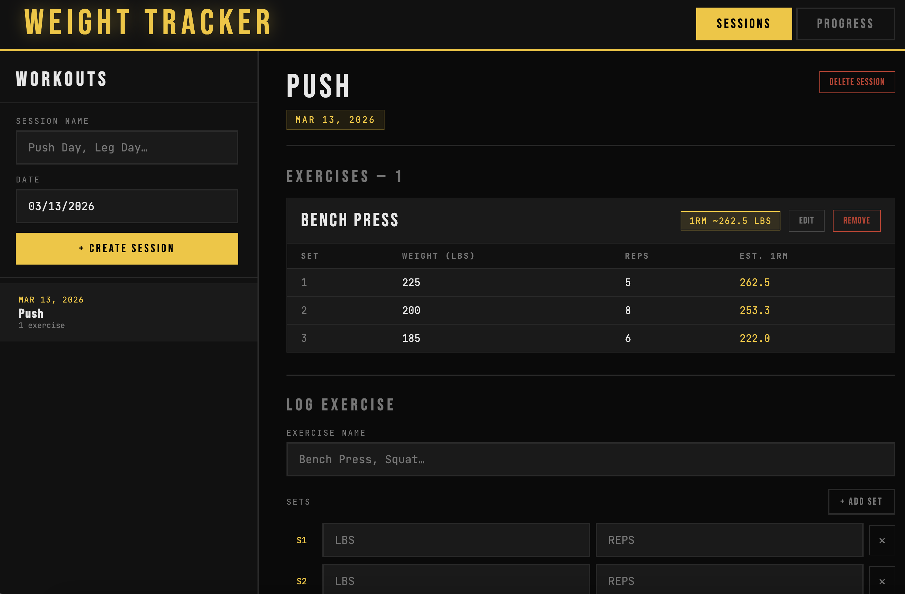
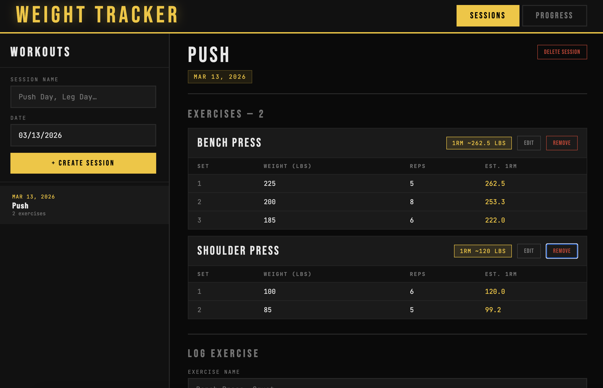
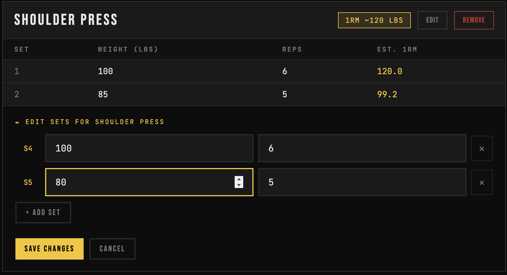
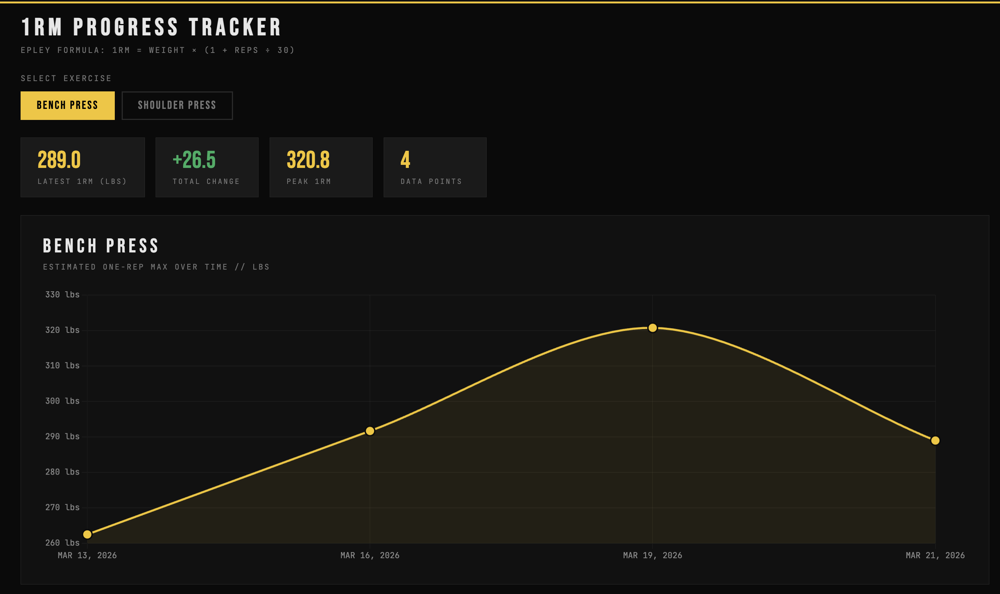

# WORKOUT TRACKER
## Install packages from requirements.txt, to run app in terminal: uvicorn main:app 

Enter a date and time to create a workout session

You can then enter a exercise name as well as the weight and reps per exercise

To demonstrate, this is 3 set of bench press, giving you your 1RM across all three sets, as well as your best 1RM 

We can also add other exercises you did during the same sesssion as well as edit or delete them

This is a demo of us editing our shoulder press exerecise, changing the values

There is also a progress panel to track your 1RM over time displaying some helpful info and a graph via Chart.js

