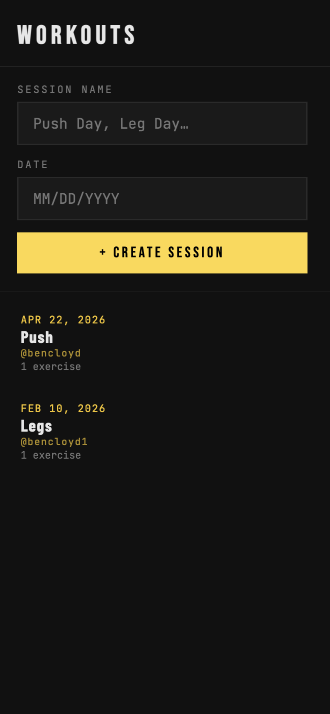
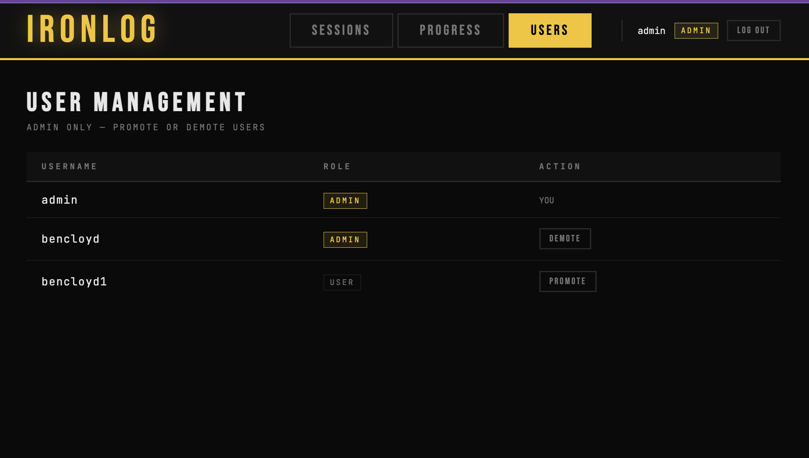

# WORKOUT TRACKER
## Install packages from requirements.txt, to run app in terminal: cd intro frontend and run 'npm run dev' and then cd into backend and run 'uvicorn main:app'
## Database
example .env file contents:
DATABASE_URL="mongodb://localhost:27017/fitness-tracker"
SECRET_KEY = "3f8a2c1d9e4b7f6a0c5d2e8b1a4f7c3d9e6b2a5f8c1d4e7b0a3f6c9d2e5b8a1"

## User
Two roles, admin and users
Admins have control over admin promotions and demotions and able to alter users workout sessions

Create an account, using username/password, then sign in

Enter a date and time to create a workout session

You can then enter a exercise name as well as the weight and reps per exercise

To demonstrate, this is 3 set of bench press, giving you your 1RM across all three sets, as well as your best 1RM 

We can also add other exercises you did during the same sesssion as well as edit or delete them

This is a demo of us editing our shoulder press exerecise, changing the values

There is also a progress panel to track your 1RM over time displaying some helpful info and a graph via Chart.js

Admin can alter other users workout session on their behalf

Admin dashboard lets an admin promote and demote other users

# Development

A FastAPI + React web application for tracking weightlifting sessions and visualizing estimated 1-rep max (1RM) progress over time.

## Features
 
- **CRUD for Sessions** — create, view, and delete workout sessions
- **CRUD for Exercises** — log exercises with multiple sets (weight × reps) to any session
- **Estimated 1RM** — automatically calculated per exercise using the **Epley formula**:
  > `1RM = weight × (1 + reps / 30)`
- **Progress Chart** — visualize your estimated 1RM over time for any exercise
- **In-memory database** — all data stored in a Python list (no database setup required)

## API Endpoints
 
| Method | Endpoint | Description |
|--------|----------|-------------|
| `GET` | `/sessions` | List all sessions |
| `POST` | `/sessions` | Create a new session |
| `GET` | `/sessions/{id}` | Get a session with its exercises |
| `DELETE` | `/sessions/{id}` | Delete a session |
| `POST` | `/sessions/{id}/exercises` | Add an exercise to a session |
| `DELETE` | `/sessions/{id}/exercises/{ex_id}` | Remove an exercise |
| `GET` | `/exercises` | List all unique exercise names |
| `GET` | `/progress/{exercise_name}` | Get 1RM history for an exercise |